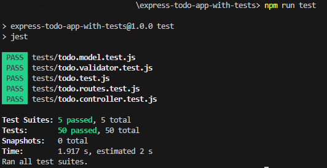
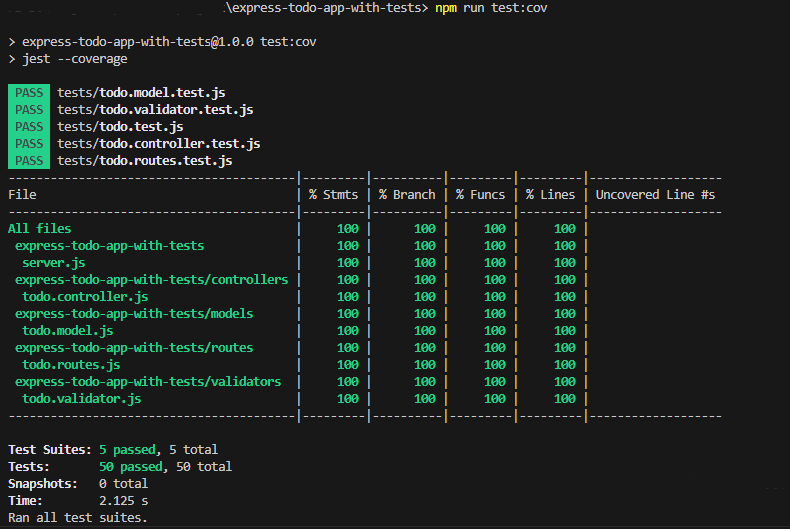

# Express Todo App with Tests

A simple Express-based Todo application featuring **unit**, **integration**, and **load testing**. This project uses **Jest** and **Supertest** for testing, and **Artillery** for load testing. It provides an API to manage todos, with functionality to create, read, update, and delete todos.

## Features

- **Create Todo**
- **Get All Todos**
- **Get Todo by ID**
- **Update Todo**
- **Delete Todo**

## Technologies

This application is built with the following technologies:

- **Node.js**: JavaScript runtime
- **Express**: Web framework
- **Jest**: Testing framework
- **Supertest**: HTTP assertions
- **uuid**: For generating unique IDs
- **Artillery**: Modern, powerful, and easy-to-use load testing toolkit.

## Installation

### Prerequisites

Make sure you have the following installed on your machine:

- Node.js (v14 or above)
- npm (Node Package Manager)

### Steps

1. **Clone the repository**:

    ```bash
    git clone https://github.com/melos-simeneh/express-todo-app-with-tests.git
    cd express-todo-app-with-tests
    ```

2. **Install the dependencies**:

    ```bash
    npm install
    ```

## Running the Application

To run the application in development mode, use the following command:

```bash
npm start
```

This will start the Express server on **port 3000**.

## Running Tests

To run the test suite and check the code coverage, use the following commands:

### Run Tests Without Coverage

```bash
npm run test
```

This command runs Jest tests and outputs the results to the terminal. It's faster when you only need to verify functionality.

**Sample Output**:


### Run Tests Coverage

```bash
npm run test:cov
```

This command runs Jest tests and generates a coverage report. It will output the test results and coverage percentage, helping you track the coverage. Your goal is to achieve **100%** code coverage.

**Sample Output**:


### Load Testing with Artillery

To simulate traffic and evaluate the performance of your application, Artillery load testing is included.

**Run Load Test**
To run the load tests, execute the following command:

```bash
npm run load-test
```

This will use **Artillery** to simulate a series of API requests and provide performance metrics for your Express application.

## Conclusion

This project provides a simple, yet effective way to test and load test an Express-based Todo application. It utilizes **Jest** and **Supertest** for unit and integration tests, ensuring that all endpoints work as expected, while also using **Artillery** to evaluate how the application performs under load.

## Thank You

Thank you for exploring this project! I hope it helps you understand how to build, test, and optimize Express applications. Feel free to contribute, open issues, or fork the repository to improve or extend the functionality.

If you have any questions, feel free to reach out or leave an issue in the GitHub repository.

**Happy Coding!** 🎉
